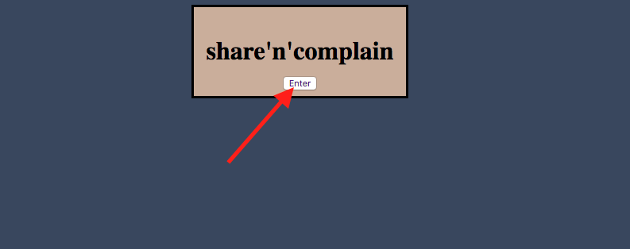
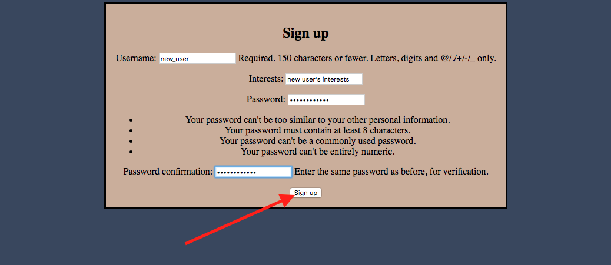
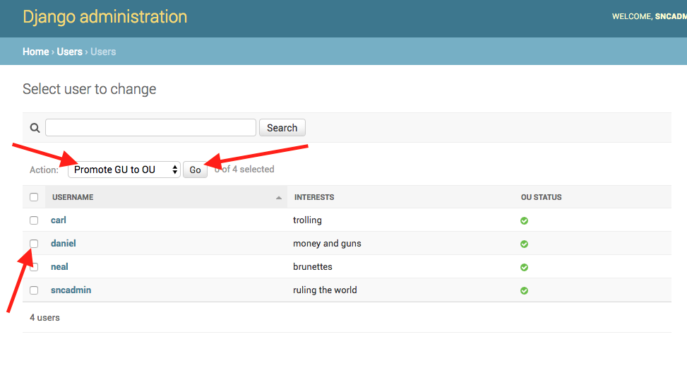

# share'n'complain

### Neal Rea, Daniel Vignoles, Carlton Welch

## Dev Setup
1. Move to share_n_complain directory
```
$ cd share_n_complain
```
2. Create virtual environment (only required on initial setup)
```
$ python3 -m venv ~/.virtualenvs/sharencomplain
```
3. Activate virtual environment
```
$ source ~/.virtualenvs/sharencomplain/bin/activate
```
4. Install Django (only required on initial setup)
```
$ pip install Django
```
5. Launch share_n_complain
```
$ python3 manage.py runserver
```
6. Open browser (optimized for Chrome and Safari) and navigate to server location (http://localhost:8000/)

## Built-in Users/Passwords
### Admin/Superuser
| Username |   Password  |
|----------|-------------|
| sncadmin | sncpassword |
### Ordinary Users
| Username |   Password   |
|----------|--------------|
|   carl   |   carlcarl   |
|  daniel  | danieldaniel |
|   neal   |   nealneal   |

## Getting Started (New User Creation)
### 1. Enter Site

### 2. Enter as Guest User

### 3. Apply to become an Ordinary User


### 4. Promote new user to Ordinary User


#### View All Users

#### Check desired user, select "Promote GU to OU" from dropdown, and click "Go"

### 5. Logout Admin and Login as new Ordinary User


### 6. Share 'n Complain!!


